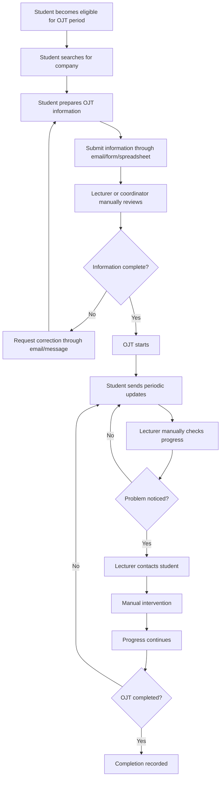

# AS-IS OJT Management Process

## 1. Purpose

This document models a plausible fragmented/manual baseline process for analysis purposes.

It is a **working assumption**, not a claim that every university operates exactly this way.

---

## 2. AS-IS Flow

---

## 3. Main Pain Points

1. Information may be distributed across several channels.
2. Review status may not be visible to all authorized participants.
3. Monitoring requires manual effort.
4. There may be no central risk prioritization.
5. Intervention may begin only after a visible problem occurs.
6. Intervention history may be incomplete.
7. Reporting may require manual consolidation.

---

## 4. Analysis Note

This AS-IS flow will later be validated or adjusted if a real university process owner is available.
