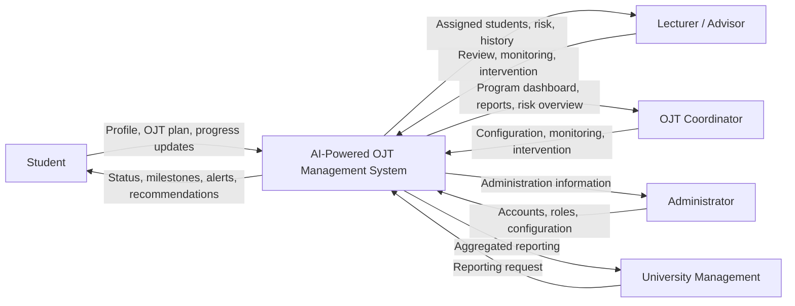

# System Context

## Context Boundary

The system does not initially replace:
- the university's full Student Information System;
- an LMS;
- company HR systems;
- payroll systems.

External integration can be added later through defined APIs or import processes.
