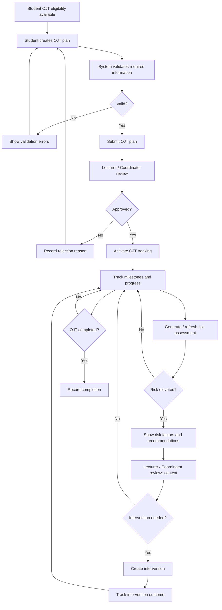

# TO-BE OJT Management Process

## 1. Objective

Create a centralized process where operational data, progress monitoring, risk assessment, and intervention are connected.

---

## 2. TO-BE Flow

---

## 3. Expected Improvements

- Centralized student and OJT information.
- Explicit workflow status.
- Earlier visibility of risk.
- Risk-based prioritization.
- Traceable intervention actions.
- Historical prediction records.
- Easier operational reporting.

These are intended improvements and must later be measured rather than assumed.
